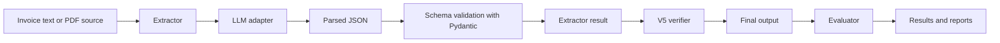

# Invoice / Receipt Field Extractor

A clean Python assessment project for extracting structured fields from invoice and receipt text using an LLM-backed abstraction. The implementation is designed to be easy to understand, version prompt changes, evaluate JSON outputs against ground truth, and support later PDF/text ingestion without changing the extraction schema.

## Objective

Extract the following fields from an invoice or receipt:

- invoice_number
- invoice_date
- vendor
- bill_to
- subtotal
- tax
- total
- payment_terms
- currency

The output must be valid JSON and every missing field must be represented as `null` rather than invented.

## Architecture



## Project Structure

```text
.
├── data/
│   ├── invoices/
│   ├── ground_truth/
│   └── outputs/
├── prompts/
│   ├── v1.txt
│   ├── v2.txt
│   ├── v3.txt
│   ├── v4.txt
│   └── v5.txt
├── src/
│   ├── __init__.py
│   ├── config.py
│   ├── llm_client.py
│   ├── schema.py
│   ├── extractor.py
│   ├── verifier.py
│   ├── evaluator.py
│   ├── report.py
│   └── main.py
├── tests/
├── results/
├── .env.example
└── requirements.txt
```

## Setup

1. Create a Python virtual environment.
2. Install dependencies:

```bash
pip install -r requirements.txt
```

3. Copy `.env.example` to `.env` and set the environment variable:

```bash
GEMINI_API_KEY=your_key_here
```

4. Run tests:

```bash
pytest
```

## Environment Variables

The project supports:

- `GEMINI_API_KEY` for Gemini-compatible API access.
- `GEMINI_MODEL` optional model override.
- `temperature` default temperature.
- `max_output_tokens` maximum output tokens.
- `prompt_version` selected prompt version.

## Creating and Adding Invoices

Add a text invoice under `data/invoices/invoice_01.txt` with a plain-text representation of the receipt or invoice. You can later add a PDF ingestion layer in the same structure.

## Creating Ground Truth

Add a ground-truth JSON file beside the corresponding invoice, for example:

```text
data/ground_truth/invoice_01.json
```

The ground truth uses the same schema as the extractor, with `null` where a field is genuinely absent.

## Running Extraction

```bash
python -m src.main extract --input data/invoices/invoice_01.txt --prompt-version v5
```

## Running Evaluation

```bash
python -m src.main evaluate --prompt-version v5
python -m src.main evaluate-all
```

## Prompt Versions

The prompts directory contains five versions:

- `v1.txt`: zero-shot extraction.
- `v2.txt`: role and abstention instructions.
- `v3.txt`: schema and normalization constraints.
- `v4.txt`: few-shot examples with absence vs hallucination guidance.
- `v5.txt`: extraction + verification + formatting prompt chain.

## Metrics and Hallucination Handling

The evaluator calculates field-level precision, recall, F1, exact accuracy, coverage, hallucination count, false positives, and tax-specific hallucination statistics from model outputs and ground-truth data.

## Tax Absence Test

The project includes a dedicated test for invoices where tax is genuinely absent. In that case, the extraction must return `"tax": null` instead of inferring or calculating zero.

## Example Input and Output

Example output:

```json
{
  "invoice_number": "INV-2024-0891",
  "invoice_date": "2024-03-15",
  "vendor": "ACME Supplies Ltd",
  "bill_to": "Zenith Corp",
  "subtotal": 61.0,
  "tax": 10.98,
  "total": 71.98,
  "payment_terms": "Net 30",
  "currency": null,
  "_confidence": {
    "currency": "absent"
  }
}
```

## Limitations

The first version is text-only. PDF and image extraction are intentionally isolated behind a source abstraction and can be added later.

## Future Improvements

- Add real Gemini API integration behind the adapter.
- Add a PDF/text extraction source abstraction.
- Expand results and reports.
